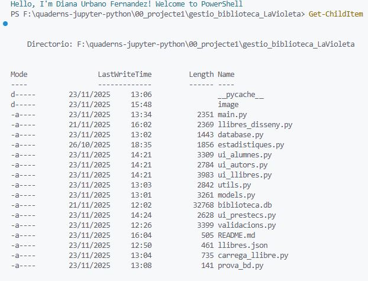
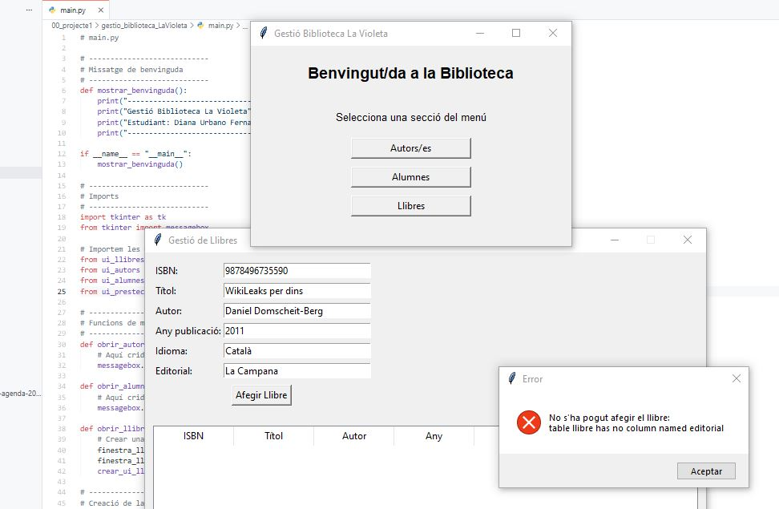
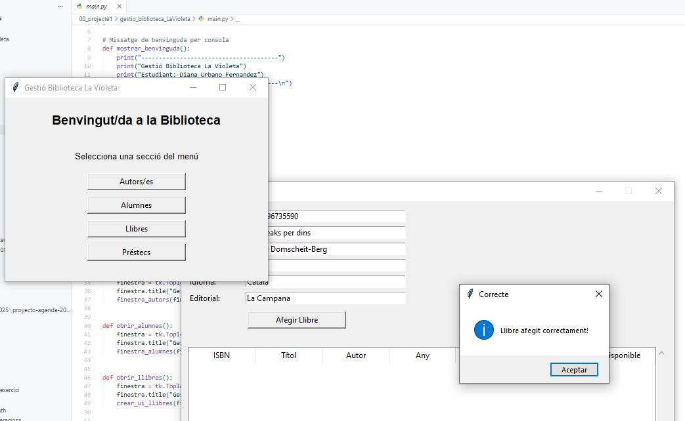

# Gestió Biblioteca La Violeta.

###### Projecte desenvolupat per **Diana Urbano** com a part del curs Algoritmica amb Python.

L'aplicació permet gestionar una biblioteca, utilitzant **Tkinter** per a la interfície gràfica i **SQLite** per a l'emmagatzematge de les dades i la seva persistència.

# Punts clau del projecte

# ■ 1. Pantalla de benvinguda

En executar el projecte mitjançant main.py, PowerShell mostra un missatge de benvinguda personalitzada amb el nom de l'usuari.

El projecte està construït seguint una **estructura modular**, facilitant tant la lectura com el manteniment.

- **Autors/es**
- **Alumnes**
- **Llibres**
- **Préstecs**

# ■ 2. Missatge de benvinguda amb PowerShell

# ■ 3. Estructura del projecte

A continuació es mostra l'estructura dels arxius dins del projecte.

# ■ 4. Funcionalitats principals

### Gestió de llibres

Permet afegir llibres, editar i eliminar llibres.

Inclou validació de camps obligatoris i comprovació de dades.

### Gestió d'autors/es

Creació, modificació i eliminació d'autors/es registrats a la base de dades.

### Gestió d'alumnes

Permet registrar i gestionar alumnes del centre.

### Gestió de préstecs

Si estigués habilitada, permet crear, consultar i retornar préstecs de llibres.

## ■ 5. Procés de depuració i proves amb IA

A mesura que el projecte avançava, he anat implementant les funcionalitats pas a pas. Quan mhe trobat amb errors, com "table llibre has no

column named editorial", he anat provant solucions amb prova-error, contrastant la informació amb la IA i els quaderns del curs. Finalment,

després de molts intents i canvis i ajustar codi, els llibres s'afegeixen correctament i es mostren a la interficie.

---

# ■ 6. Base de dades SQLite (Persistència)

El fitxer **`biblioteca.db`** conté totes les **taules** necessàries:

- `llibres`
- `autors`
- `alumnes`
- `prestec`

Aquest arxiu es genera automàticament si no existeix.

# ■ 7. Validacions

El projecte inclou validació de formularis per garantir:

* Camps obligatoris no buits
* Validació de tipus (numérics, text, correu electronic, etc.)
* Missatges d'error clars mitjançant **Tkinter (messagebox)**

# ■ 8. Execució del projecte

cd F:\quaderns-jupyter-python\00_projecte1\gestio_biblioteca_LaVioleta
python main.pyAutora

Projecte desenvolupat per **Diana Urbano Fernández**

Curs **Algorísmica i programació amb Python 2025**
